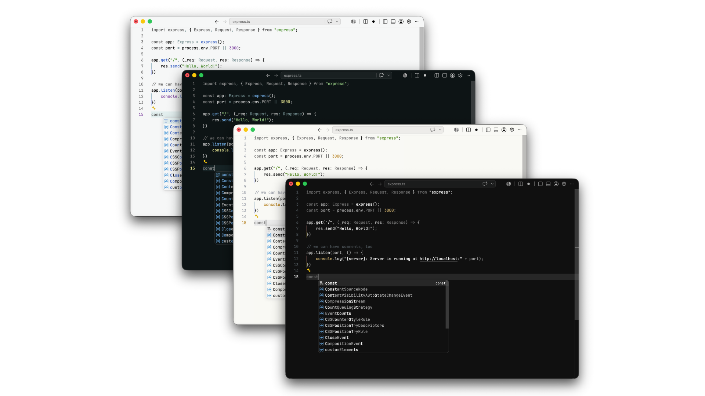
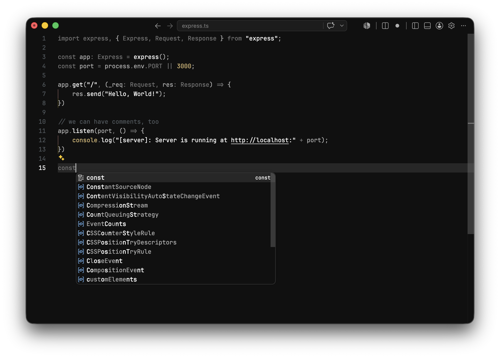
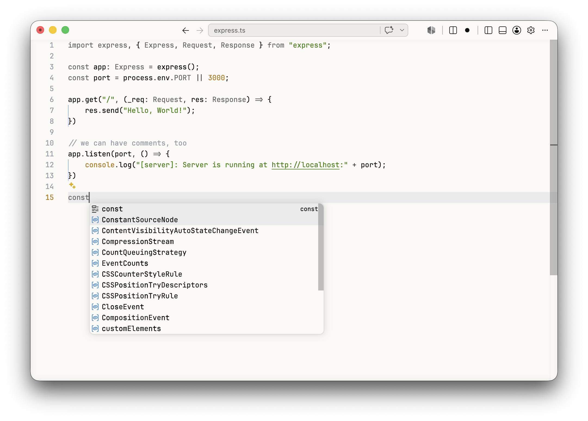
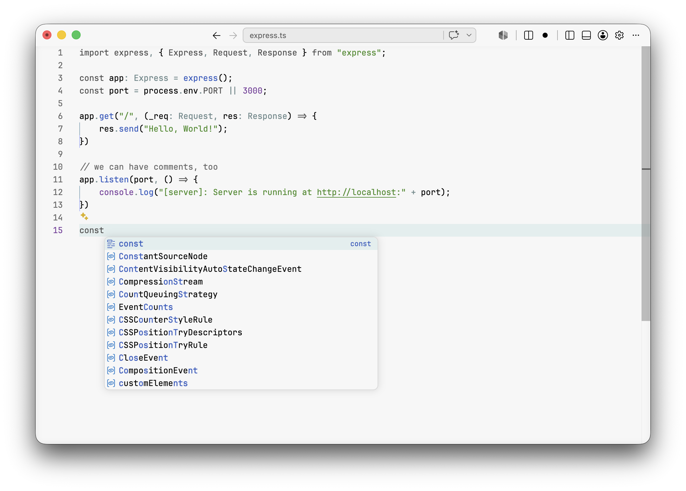
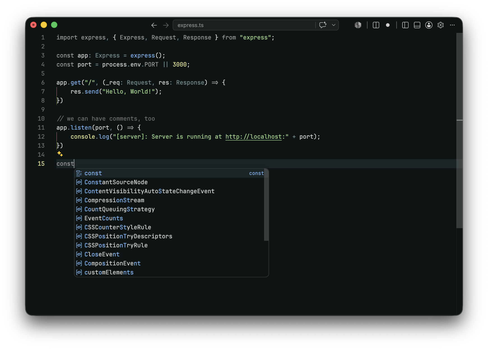

<div align="center">

# Koda for Visual Studio Code

**A quiet, minimal dark theme for focused coding.**  
A faithful Visual Studio Code port of [koda.nvim](https://github.com/oskarnurm/koda.nvim) by [oskarnurm](https://github.com/oskarnurm).

<p>
  <a href="https://marketplace.visualstudio.com/items?itemName=davellen.koda-theme-vscode"><strong>Install Koda</strong></a>
</p>

<p>
  <a href="https://marketplace.visualstudio.com/items?itemName=davellen.koda-theme-vscode"></a>&nbsp;&nbsp;
  &nbsp;&nbsp;
  &nbsp;&nbsp;
  <a href="https://open-vsx.org/extension/davellen/koda-theme-vscode"></a>&nbsp;&nbsp;
  <a href="./LICENSE"></a>
</p>

</div>



## Features

- Multiple Koda themes
- Dark minimal UI
- Light and dark variants
- Koda.nvim inspired syntax highlighting
- Semantic highlighting support
- Customized VS Code workbench chrome
- Carefully tuned TextMate scopes and semantic tokens
- Designed for distraction-free coding sessions

## Themes

Koda includes four carefully ported themes from the original koda.nvim project:

- **Koda Dark**
- **Koda Light**
- **Koda Glade**
- **Koda Moss**

Each theme keeps the original Koda color philosophy while adapting it to VS Code's syntax and semantic highlighting system.

---

## Koda Dark

<details>
<summary>Show screenshot</summary>

<br>



</details>

---

## Koda Light

<details>
<summary>Show screenshot</summary>

<br>



</details>

---

## Koda Glade

<details>
<summary>Show screenshot</summary>

<br>



</details>

---

## Koda Moss

<details>
<summary>Show screenshot</summary>

<br>



</details>

---

## Installation
 
**From the Marketplace:**
 
1. Open the Extensions view in VS Code (`Ctrl+Shift+X` / `Cmd+Shift+X`)
2. Search for **Koda Theme**
3. Click **Install**
**Or via Quick Open:**
 
Launch Quick Open (`Ctrl+P` / `Cmd+P`), paste the command below, and press **Enter**:
 
```
ext install davellen.koda-theme-vscode
```
 
Then select **Koda** from the theme picker (`Ctrl+K Ctrl+T` / `Cmd+K Cmd+T`).

## Credits

This theme is a port of the original Neovim theme created by **oskarnurm**:
 
🔗 [koda.nvim on GitHub](https://github.com/oskarnurm/koda.nvim)
 
All love for the original palette and design goes to the original author. This extension simply brings that experience to VS Code.
 
<div align="center">
<sub>If you enjoy Koda, consider leaving a ⭐ on the the original github repo of <a href="https://github.com/oskarnurm/koda.nvim">koda.nvim</a> theme</sub>
</div>

